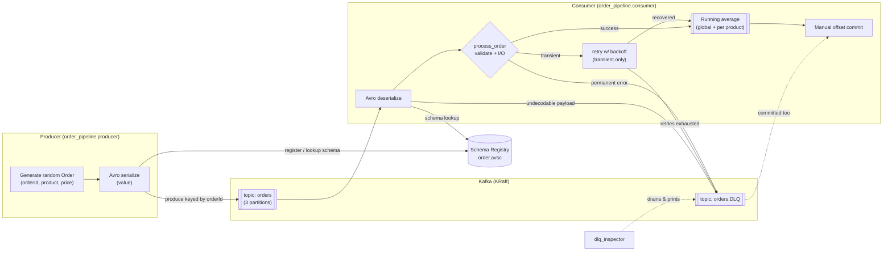
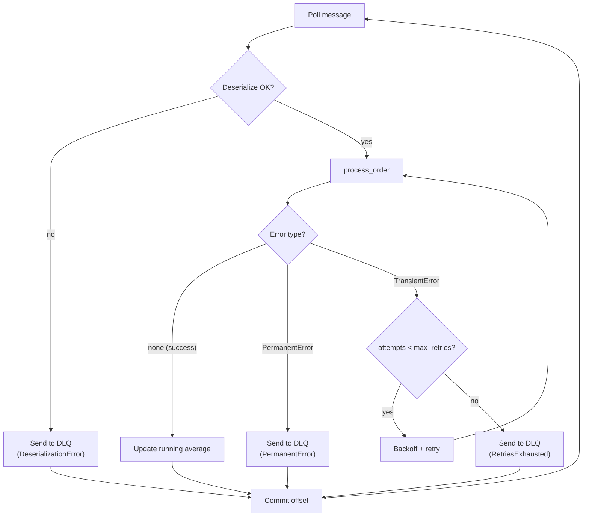

# Architecture

## Component / data-flow diagram

## Message-handling decision flow

## Why these choices

* **KRaft mode (no ZooKeeper):** the current, simplest single-broker setup for
  modern Kafka (7.x); fewer moving parts for a local demo.
* **Schema Registry + Avro:** the schema is registered once and referenced by id
  in each message, so payloads stay small and producers/consumers cannot drift
  out of sync. It also enables controlled schema evolution.
* **Key = `orderId`:** guarantees per-order ordering by pinning all events for an
  order to one partition, while still allowing horizontal scale across orders.
* **Manual offset commit after handling:** yields at-least-once semantics with no
  message loss — an offset is only advanced once the message has been processed
  or safely parked in the DLQ.
* **Separate DLQ topic with header metadata:** keeps the main stream clean while
  preserving the exact failed payload plus the context needed to diagnose or
  replay it.
